# "Setting Up a Virtual Private Cloud (VPC) with Public Subnet, Route Tables, Internet Gateway, and Launching an EC2 Instance: A Step-by-Step Guide"

This project will walk you through the process of creating a secure and scalable virtual network in the cloud using Amazon Web Services (AWS). You'll learn how to:

1. Create a Virtual Private Cloud (VPC) with a public and private subnet
2. Configure route tables for internet access
3. Set up an internet gateway for external connectivity
4. Launch an EC2 instance (virtual machine) within your VPC.

### Step 1 : Setting up a Virtual Private Cloud (VPC)

1. Navigate to the search bar.

a) Type "VPC", once it pops up, click on it. This will direct you to the Virtual Private Cloud (VPC) page.

b) Click the "create VPC" button

2. Follow the prompt below.
- Select VPC only
- Choose a name for your Vpc
- Select IPv4
- Input the IPv4 CIDR

- Leave the Tenancy on default

- Click the "Create VPC" button.

2a. Successfully created.

### Step 2 : Creating an Internet Gateway.

1. Navigate to Internet gateway by the left side bar, this will redirect you to another page, click the "Create internet gateway" button.

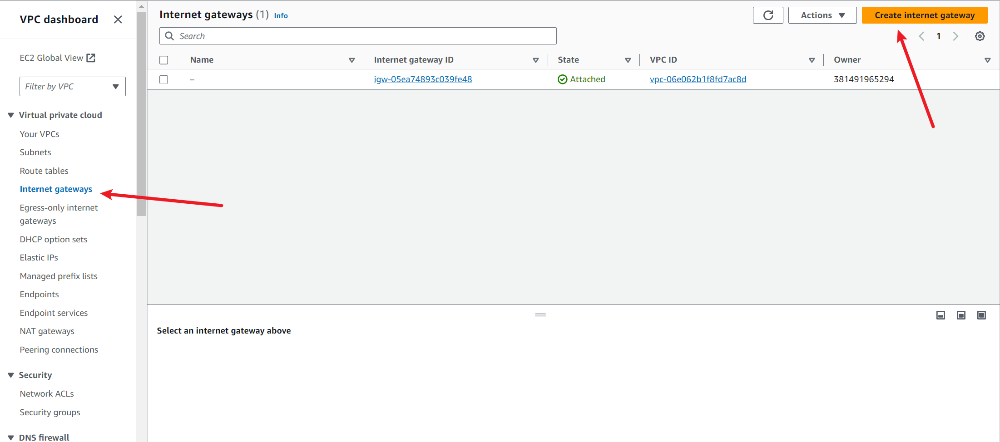

a) Give a name for your internet gateway, then click on "Create internet gateway".

b) The internet gateway has been successfully created, but notice that it is detached. This shows that our internet gateway is  not attached to any VPC yet.

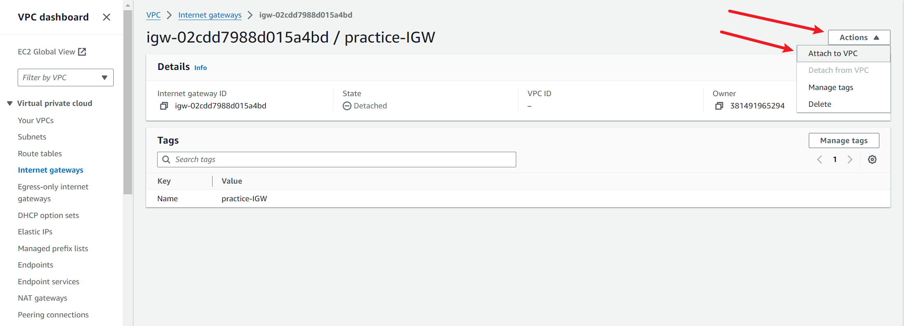

c) To attach, click the internet gateway ID.

d) Click the "Action" button,then click the "attach to VPC" button.

c) Select the VPC we created earlier, then click  the "Attach internet gateway".

### Step 3: The next resource to create is a public and private subnet.

1. Navigate to the subnets on the left side.

a) click the "Create subnets" button

#### *Note:*  
Remember that we are operating within the scope of a Virtual Private Cloud (VPC). As such, any resources we create must be explicitly associated with this specific VPC.

#### *Note:*
To ensure clarity and consistency in our subnet naming, let's adopt a convention that explicitly distinguishes between public and private subnets. This will help avoid confusion and make it easier to identify and manage our resources. In this case case we can use "Public" and "Private"

2. Follow the steps below to complete.

a) Select your VPC, in this case which is "my-practice-vpc.

b)Provide a name for your subnet

c) Choose availability zone

d) Choose your IPv4 subnet CIDR block

e) Click the "add new subnet button.

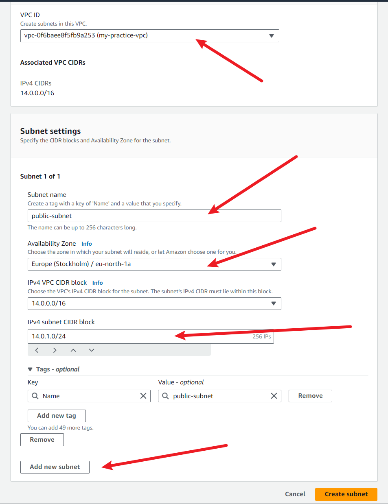

Repeat the same steps for the second subnet

f) make sure to specify the subnet name, choose the availability zone, and provide the IPv4 CIDR.

g) Click the "Create button" button.

h) Subnets successfully created.

### Step 4: Setting up our Route Table.

1. To enable routing for both our public and private subnets, we'll create separate route tables for each. First, we'll create and associate a route table with our public subnet, allowing it to access the internet. Next, we'll create a route table for our private subnet, omitting the internet route to maintain its private connectivity

a) Navigate to the route table on the left, then click on "create route table"

b) Give your route table a name.

c) Select your VPC

d) Then click the" Create route table" button

e) Our route table has been successfully created.

2. Simply creating a route table is not sufficient;we need to add a route to connect to the internet."

To achieve this;

a) Click  edit route. 

b) Click the "add route" button.

c) Select the destination field and select the IP address 0.0.0.0/0. This allows internet access and makes the route accessible from anywhere online

d) Choose the target, which represents the source of internet connectivity. In this case, select the Internet Gateway that we previously created, as it will provide the route to the internet.

e) Click the save changes button.

f) Successful.

3. Next, we'll associate our route table with our public subnet, allowing the subnet to use the defined routes for internet access.

a) Go to the Route Tables page, select the public route table we created earlier, and then click on its Route Table ID to access its details

b) Click the "subnet associations" button.

c) Click the "edit subnet association" button

d) Select the public subnet we created.

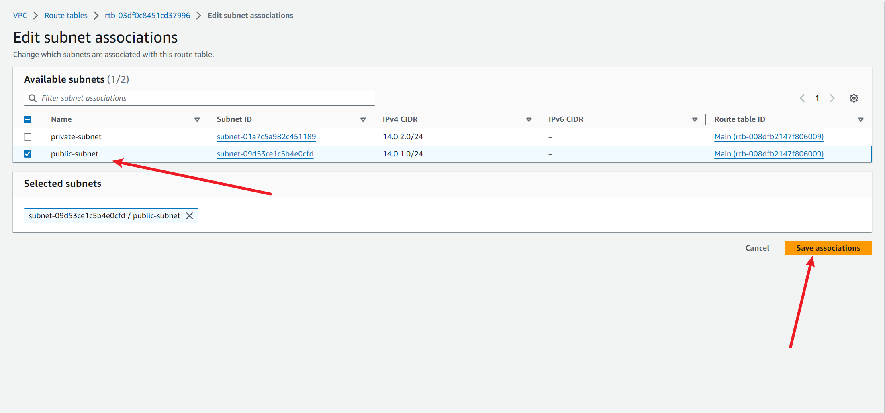

e) You will notice that the public subnet is now associated with the route table.

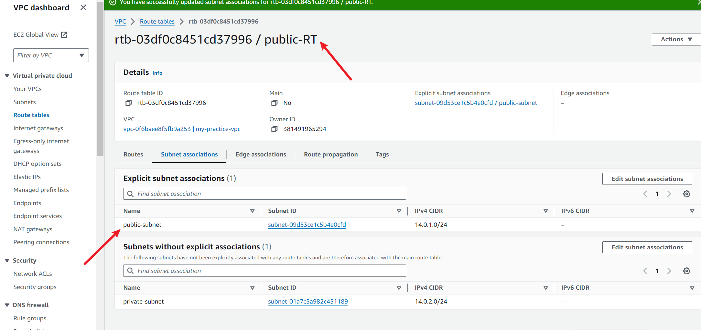

4. Let's proceed to create a route table for the private subnet.

a) Select Route Tables from the left menu and choose 'Create route table' to start a new one

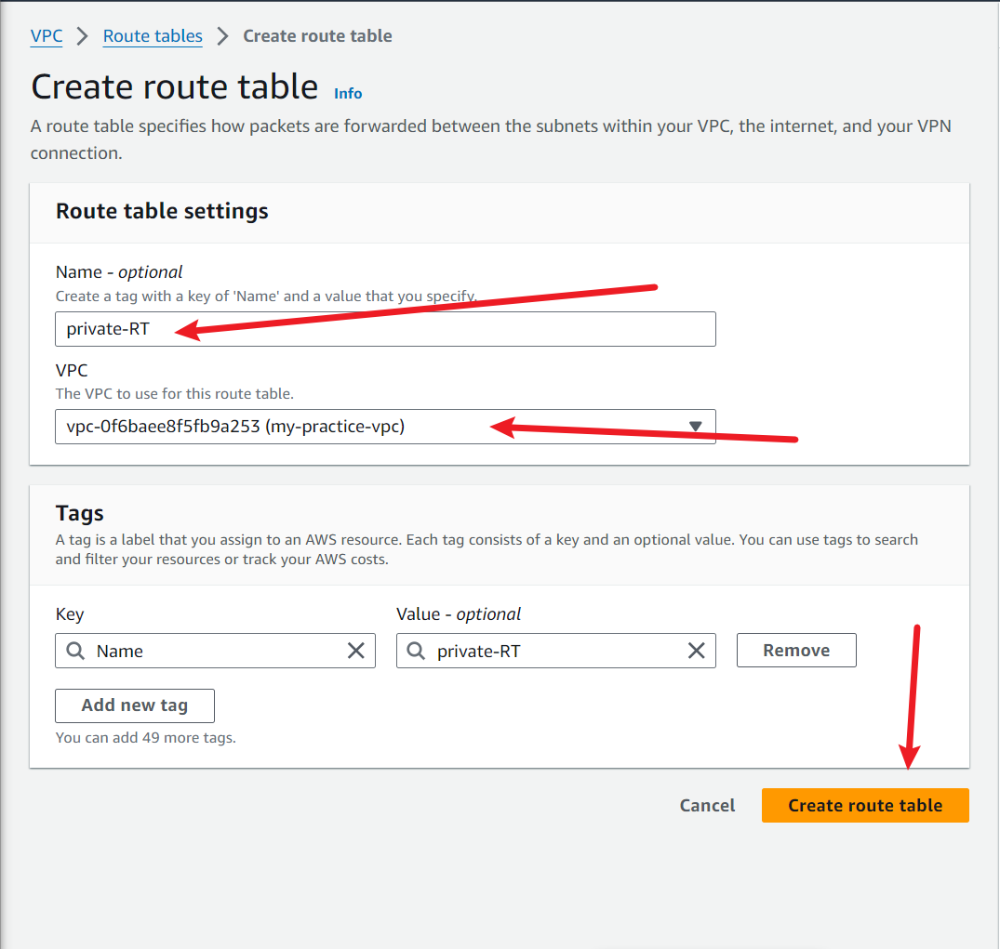

b) Enter a name for the route table.

c) Select the VPC we are working with.

d) Then click the "Create route table" button

e) Notice that your route table has been created successfully.

#### *Note:* 

This is our Private Route Table, designated for our private subnet. Unlike our public route table, we won't add an internet route here since this subnet doesn't require external access. As a private subnet and route table, internet connectivity is not necessary. We'll proceed to associate this route table with our subnet without creating any additional routes.

5. Click the "subnet associations" button,then click " edit subnet associations"

a) Select the private subnet, then click "Save associations"

b) Private subnet successfully associated.

### Step 5: Launching an EC2 Instance.

Now, we'll add a resource to our public subnet by creating an EC2 instance. Then, we'll remotely access it from our local computer using SSH.

1. Navigate to your AWS homepage and search for EC2.

a) Click the "launch instance" button.

b) Give your instance a name.

c) Select Ubuntu

d) Select the ubuntu free tier

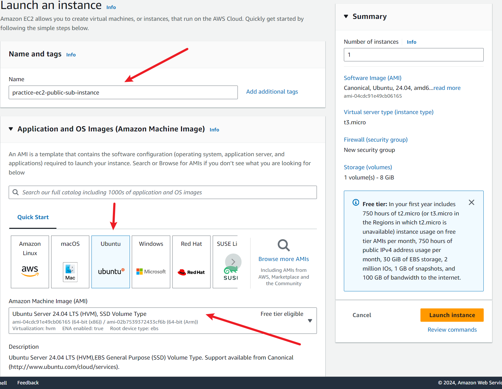

e) select the architecture or leave on default.

f) Select the instance type or leave on default.

g) Click the " Create new key pair"

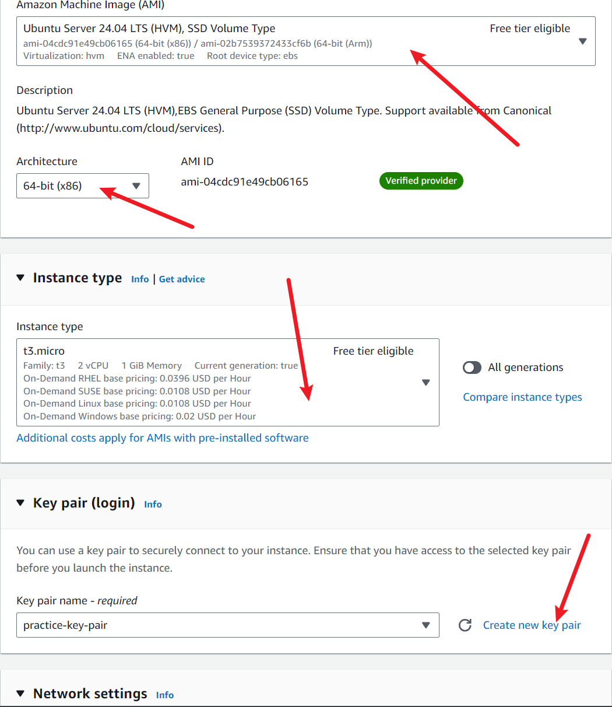

h) Give your key pair a name.

i) leave the rest on default. Then click the "Create key pair" button.

### *Note:* 

Once you click the 'Create key pair' button, the private key will be downloaded to your local system, and the public key will be automatically uploaded and stored.

j)  Proceed to edit the network settings.

Click "Network settings" button, then click the "edit" button.

k) Choose your VPC.
- select the public subnet
- Enable the auto-assign public IP

2. Proceed to create security group.

a) Click the "create security group" button.

b) Give a name to the security group

c) Give a description

d) select SSH as the security type, and the source type as "anywhere"

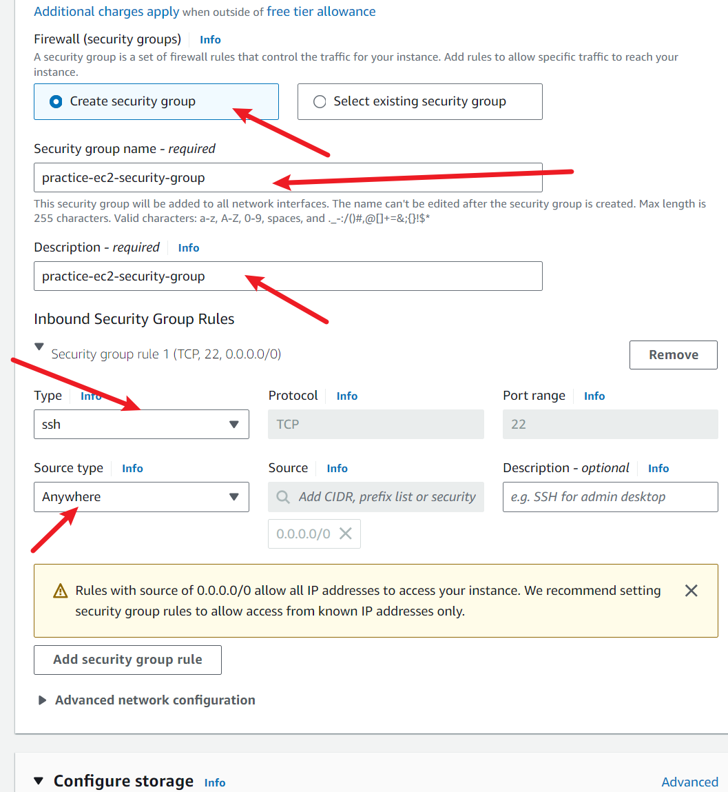

e) Configure the storage .

f) Finally, click the "Launch instance" button.

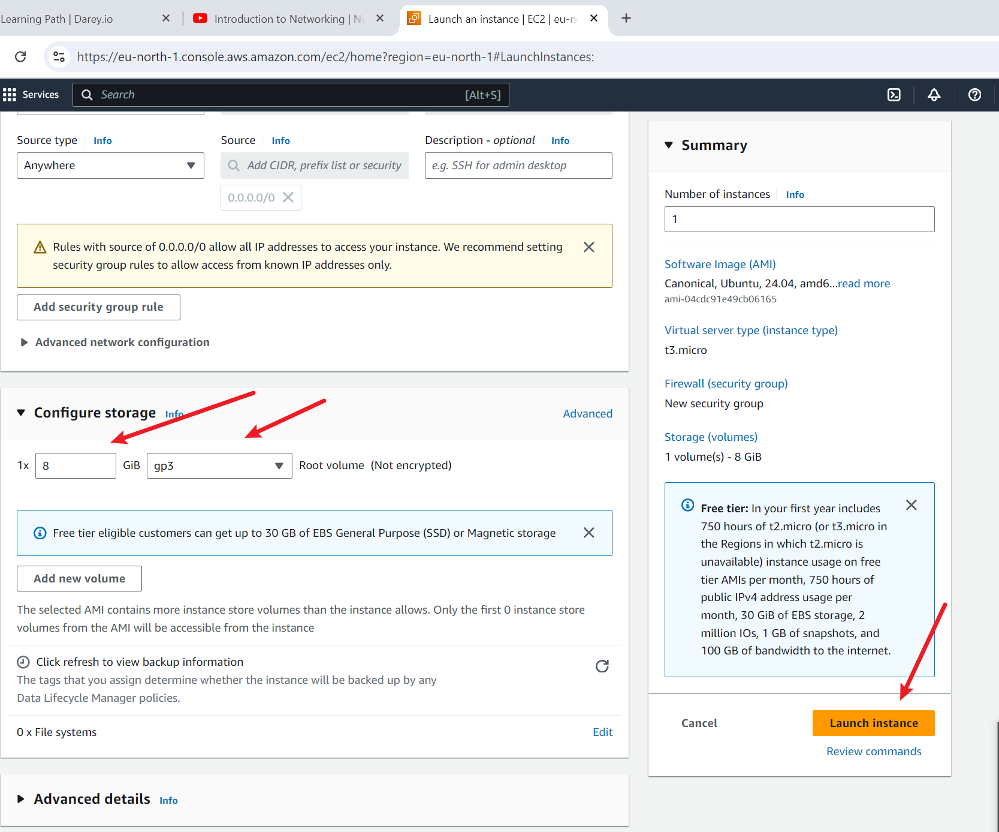

g) Instance launched successfully.

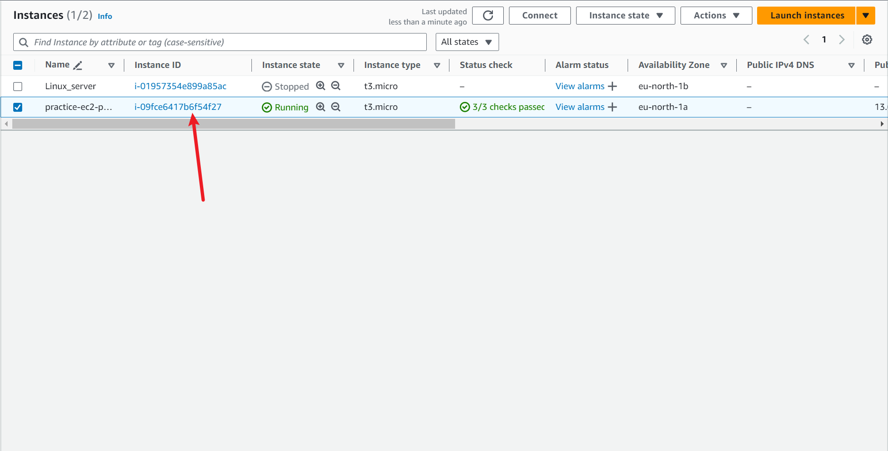

### Step 6: The next step is to establish a secure shell (SSH) connection to our EC2 instance from our local computer.

Now we'll connect to our instance using SSH from our local machine.

a) Select the instance, click the "connect" button at the top.

.

b) Open your terminal, and navigate to the directory where you have your key pair, run the "ls" command to be sure.

c) Navigate back to the SSH client page, copy the SSH command, and paste it into your terminal or command prompt in the directory where your key pair is stored.

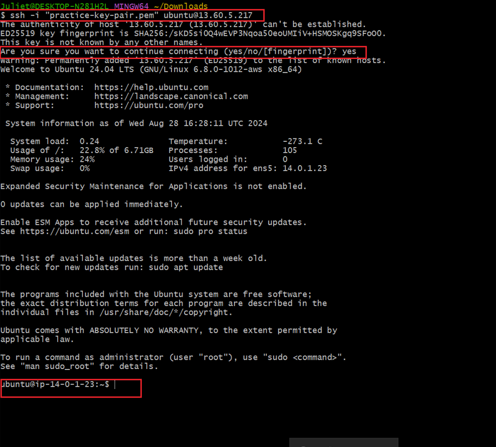

Successful connection established! We're now accessing the EC2 instance remotely from our local machine via SSH.

Thank you.

